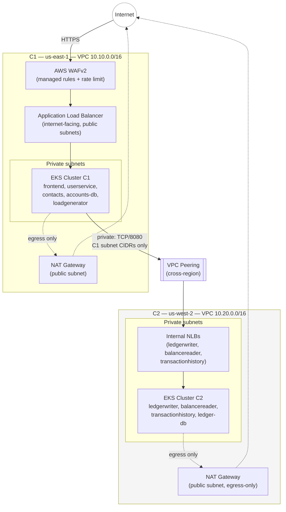
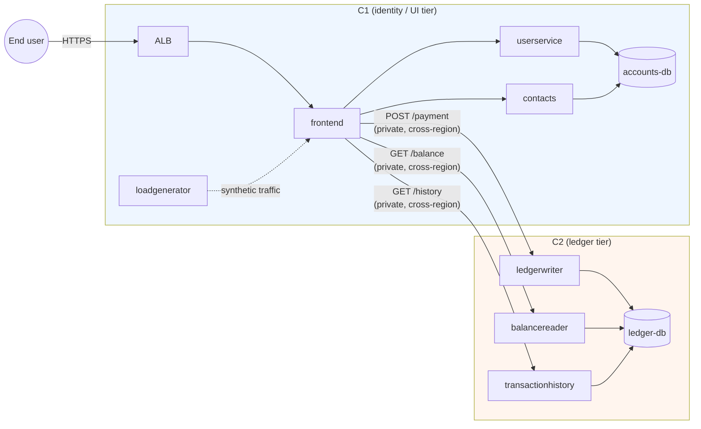
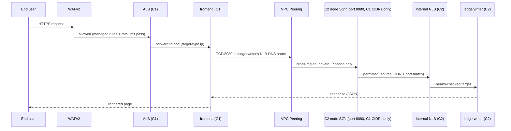
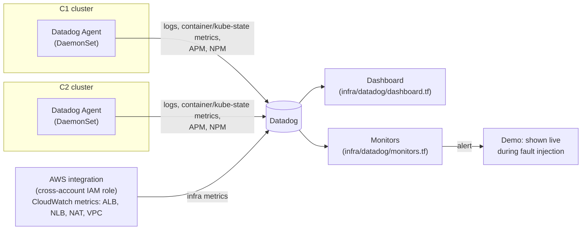

# Architecture

This document is the visual companion to `architecture-design.md` (design
rationale and trade-offs) and the root `README.md` (deploy steps). Diagrams
are Mermaid so they render natively on GitHub and stay text-diffable as the
design evolves.

## 1. Network topology

Two independent VPCs in two regions, connected by cross-region VPC Peering,
each running one EKS cluster. Only C1 has a public-facing edge (ALB + WAF);
C2 is never reachable from the internet.

**Key properties:**
- C1's public subnets host only the ALB and NAT Gateway — no pods run there.
- C2 has **no internet-facing load balancer at all**; its public subnets
  exist solely so its NAT Gateway can provide egress (image pulls, DNS,
  AWS API calls) — inbound is never possible through them.
- The only path between the two VPCs is the peering connection, and the
  only traffic permitted over it is TCP/8080 from C1's private-subnet
  CIDRs to C2's EKS node security group (see §3).
- EKS API endpoints are currently reachable from `0.0.0.0/0` for build-time
  convenience (documented trade-off in `architecture-design.md` §6); this
  is `kubectl`-to-control-plane access, not application traffic, and is a
  named follow-up to restrict before treating this as production-grade.

## 2. Application service graph (Bank of Anthos, split across clusters)

**Split rationale (full detail in `architecture-design.md` §2):** the
identity/UI tier (frontend, userservice, contacts, accounts-db) runs in C1
alongside the public entry point; the ledger tier (ledgerwriter,
balancereader, transactionhistory, ledger-db) runs in C2. This gives a
clean, single-direction C1→C2 dependency that maps directly onto the
challenge's "service in C1 must communicate with a specific service in C2"
requirement, with three real, independently-testable request/response
paths rather than one.

## 3. C1 → C2 request path, layer by layer

Every hop after the ALB stays on private IP space — no segment of the
C1→C2 path traverses the public internet. NetworkPolicy (applied inside
each cluster) narrows this further at the pod level: C2's default-deny
policy only admits traffic on port 8080 from C1's subnet CIDRs into the
ledger-tier pods specifically, and only the ledger-tier pods may reach
`ledger-db`.

## 4. Observability data flow

See `docs/fault-injection.md` for how the monitored metrics are
deliberately violated and detected.

## Where each diagram's source of truth lives

| Diagram | Backed by |
|---|---|
| §1 Network topology | `infra/terraform/modules/network`, `modules/eks`, `modules/peering`, `modules/waf` |
| §2 Service graph | `k8s/c1/`, `k8s/c2/` |
| §3 Request path | `k8s/c1/07-frontend.yaml`, `modules/peering`, `k8s/c2/07-networkpolicy.yaml` |
| §4 Observability | `k8s/addons/datadog-values.yaml`, `infra/datadog/` |
</content>
